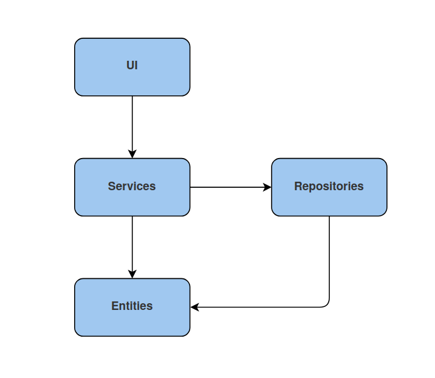
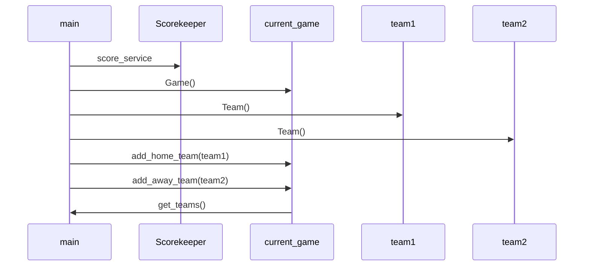

# Application architecture

## High Level 
The application is divided into four main components: the UI, services, repositories and entities. They are layered with the UI existing on top of the services and the services on top of the repositories. Entities are a dependency of the services layer. The package diagram below illustrates this. The UI naturally handles the user interface, the services takes care of the actual program logic of the application. The repository layers is the interface layer between services and the database, and handles retrieval and saving of data related to the use of the application.  
  

## User Interface
The UI is divided into 5 views, of which only one is shown at any given time. These are the following:
- The "start game" view (StartView)
- Game creation view (GameView)
- Team selection view (TeamView)
- Player selection view (PlayerView)
- Main event input view (ScorekeeperUI)

## Functionalities
At the moment the application supports beginning a new game and choosing two teams from a list of predetermined teams to play in that game. After this there is a chance to add player entities to the chosen teams, after which the main event input view is shown. Below is an example of one of the main functionalities.
### Sequence diagram illustrating beginning a new game  
To start off the use of the application a new score_service instance is initialised as "Scorekeeper". Then a new game instance is created associated with the service. Then two teams are initialised and given to the current_game. Then the teams associated with the current_game can be retrieved with the get_teams function.

