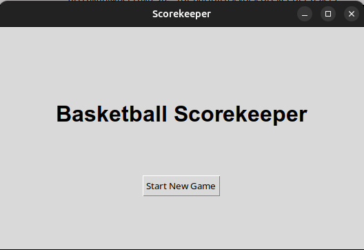
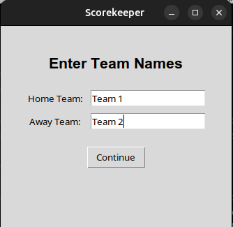
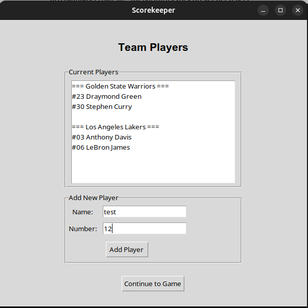
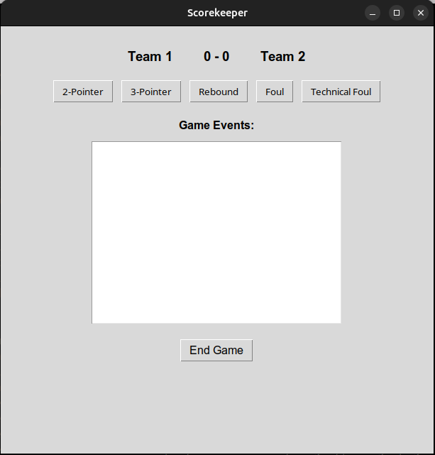
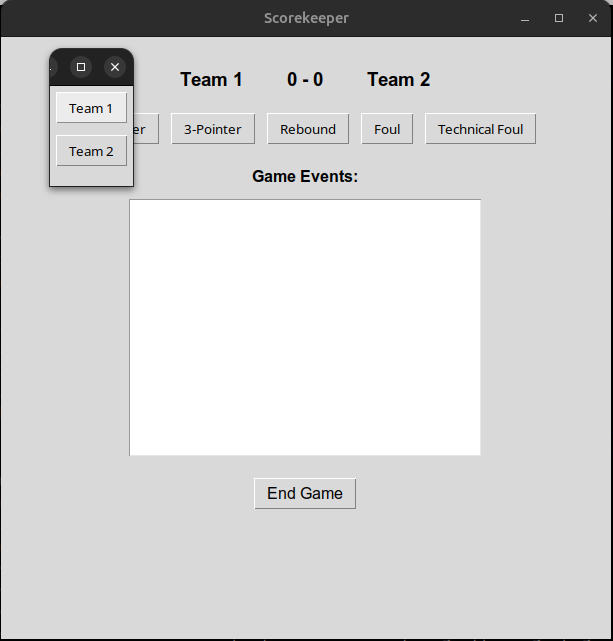
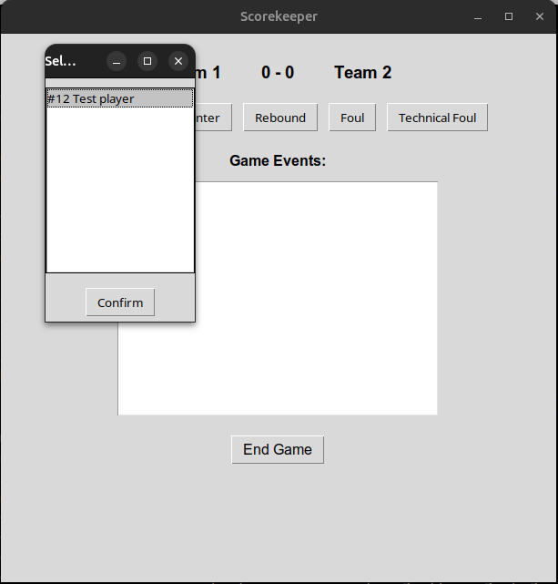
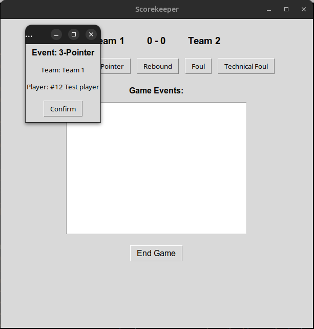
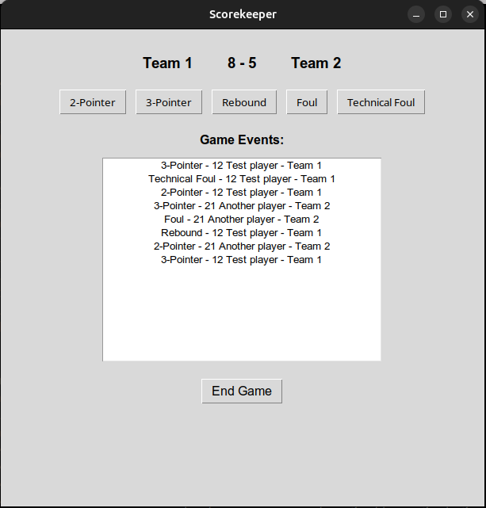
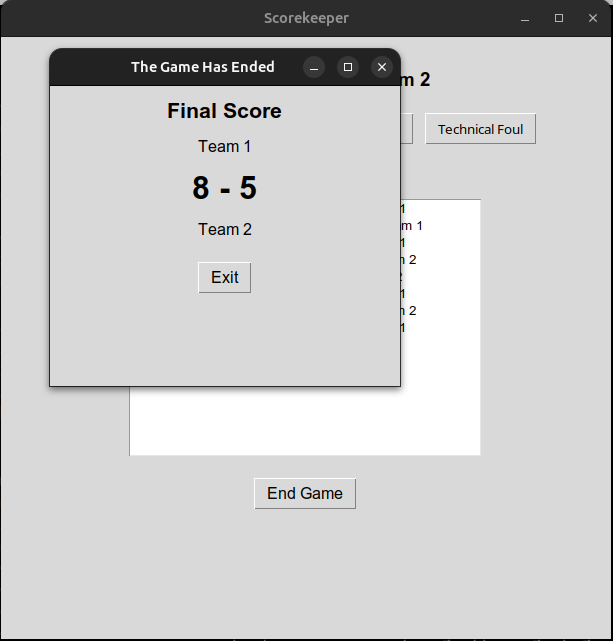

# Manual
Begin by installing the latest release of the project from the GitHub repository.  

## Configuration
To run the application install the required dependencies with:  
`poetry install`  
Enter the virtual environment with:  
`poetry shell`  
Run the application with:  
`poetry run invoke start`  

## Use of the Application
### Starting a New Game
Simply click the "Start New Game"-button to begin.  
  
### Select Teams for the Game
Then enter the names for two teams to play in the game.  
  
### Add Players to the Teams
Next you can add players to the chosen teams.  
  
### Main Event Input View
Now you are taken to the main event view.  
  
### Inputting Events 1
In this final event input view you begin by choosing the type of event and the team associated with it.  
  
### Inputting Events 2
Next choose the player associated with the event.  
  
### Inputting Events 3
Finally confirm the input of the event with the chosen data.  
  
### Inputting Events 4
Now you can see the newly input event in the "Game Events" list.  
  
### Ending the Game
When the game has run its course and all the events have been input, you can click the "End Game"-button at the bottom of the view to end the game.  
  
### Exiting the Application
In the final pop up window you can see the final score for the game you have just recorded. Clicking the "Exit" button closes the application.  
  
