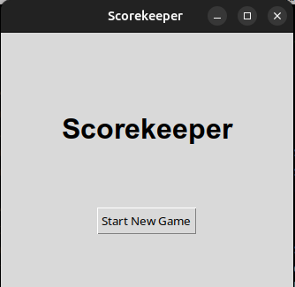
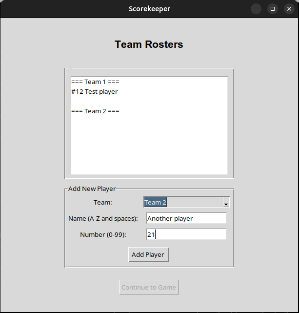

# Manual
Begin by installing the latest release of the project from the GitHub repository.  

## Configuration
To run the application install the required dependencies with:  
`poetry install`  
Enter the virtual environment with:  
`poetry shell`  
Run the application with:  
`poetry run invoke start`  

## Use of the Application
### Starting a New Game
Simply click the "Start New Game"-button to begin.  
  
### Select Teams for the Game
Then select two different teams to play in the game.  
  
### Add Players to the Teams
Next you can add players to the chosen teams.  
  
### Inputting Events 1
In the final event input view you begin by choosing the type of event and the team associated with it.  
  
### Inputting Events 2
Next choose the player associated with the event.  
  
### Inputting Events 3
Finally confirm the input of the event with the chosen data.  
  
