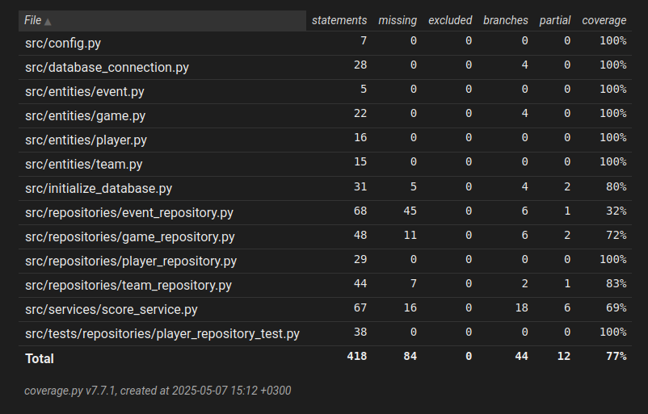

# Testing  

The application has been tested with automated pytest tests in the src/tests/ folder. These tests are intended to test the application on both the unit and integration levels. System level tests have been done by hand, by using the application.  

## Unit and integration testing

  

Most of the integration level testing is done through score_service_test.py. The tests ran through there use most of the other classes and provide a sufficient testing coverage for most of the application. Additional unit and integration testing is done through the respective test classes for the entities and repositories. The UI is not included in this testing coverage as it is tested in system testing, via exploratory usage of the application.  

## System testing and UI

### Installation
The application has been tested to work when cloned from the GitHub repository and set up according to the .[manual](https://github.com/ArttKan/ot-harjoitustyo/blob/main/scorekeeper/documentation/manual.md). This has only been verified on Linux.  

The application is not designed to make use of any prior data in the database, so the cleaning and setting up of the database prior to every execution of it is essential.

### Functionalities
System testing of the functionalities of the application has been done manually. All the available functionalities (as laid out in the .[requirement specification](https://github.com/ArttKan/ot-harjoitustyo/blob/main/scorekeeper/documentation/architecture.md)) have been tested to work and also handle incorrect use and invalid entries well.
